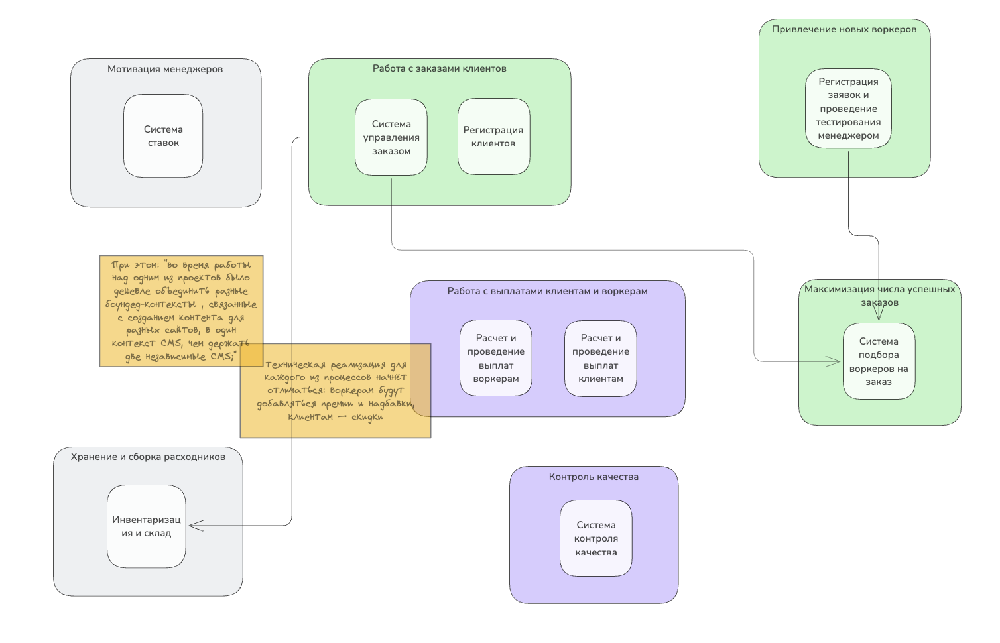
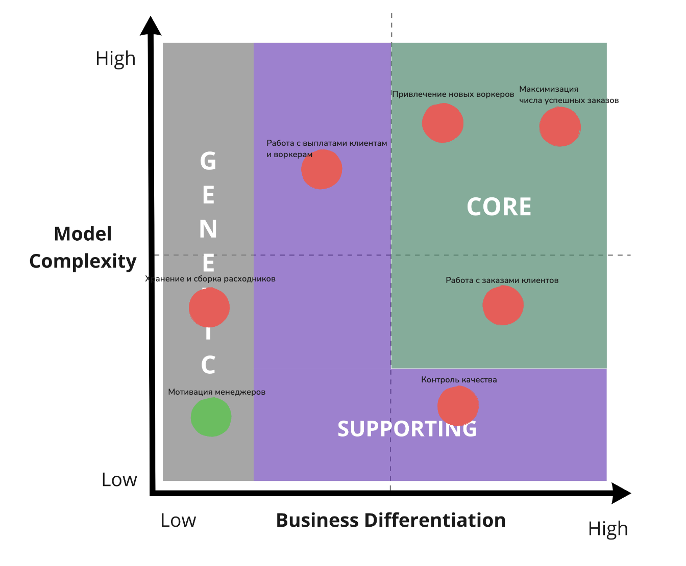
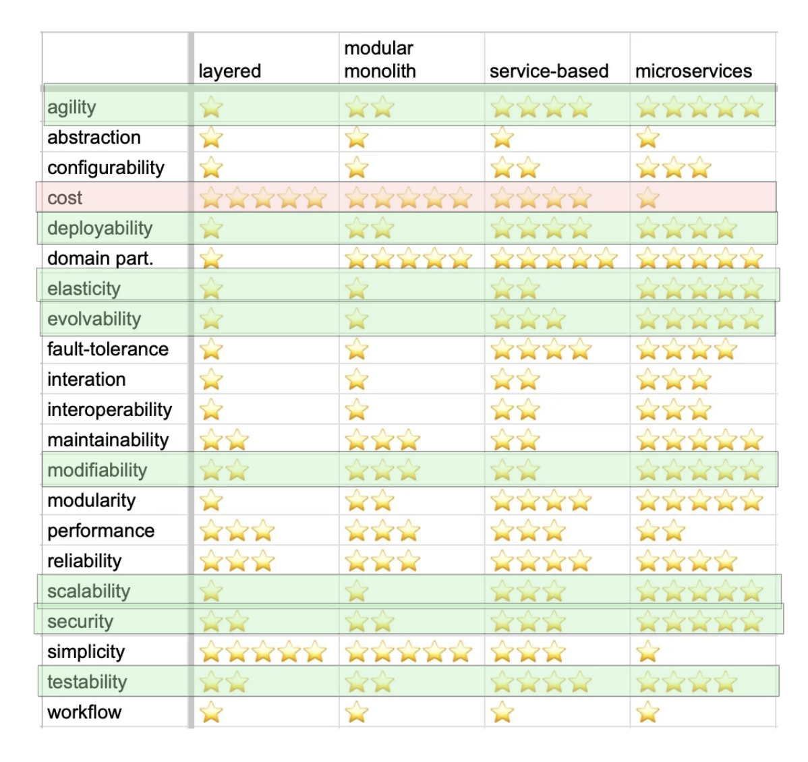

## ДЗ ко второму уроку

[Ссылка на Excalidraw (а-ля Miro)](https://link.excalidraw.com/l/AKav54V8r2d/1NqBREudp0Z)

### Поддомены

1. Работа с заказами клиентов. Решает проблемы создания заказов клиентами, взаимодействия воркеров с заказами, добавления новых типов заказов которые можно размещать на площадке.
2. Хранение и сборка расходников. Процессы сопоставления расходников воркерам.
3. Работа с выплатами клиентам и воркерам. Решение проблем связанными с расписанием выплат, выставлением инвойсов, совершением начислений.
4. Привлечение новых воркеров. Поскольку у компании есть желание гибко определять критерии отбора воркеров для увеличения качества обслуживания.
5. Контроль качества. Поскольку разные департаменты занимаются максимизацией удовлетворенности клиентов, то необходимо решить проблему по контролю.
6. Максимизация числа успешно завершенных заказов. Решение проблемы по сопоставлению заказу воркера, который завершит успешно заказ с наибольшей вероятностью.
7. Мотивация менеджеров. Немотивированные менеджеры замедляют скорость привлечения, а также качество отсева клиентов.

### Типы поддоменов

| Вид поддомена   | **Конкурентное преимущество** | **Сложность доменной модели** | **Изменчивость** |
| ---------------------------------------------- | ----------------------------- | ----------------------------- | ---------------- |
| Максимизация числа успешно завершенных заказов | да | высокая | частая |
| Привлечение новых воркеров                     | да | высокая | частая |
| Контроль качества                              | да | средняя | частая |
| Работа с заказами клиентов                     | нет | высокая | редкая |
| Работа с выплатами клиентам и воркерам         | нет | высокая | редкая |
| Хранение и сборка расходников                  | нет | низкая | редкая |
| Мотивация менеджеров                           | нет | низкая | редкая |

### Выделение bounded context'ов по strategic DDD

| **Вид поддомена** | **Предполагаемый вид поддомена** | **Выделенный боундед-контекст** |
| ---------------------------------------------- | -------------------------------- | ------------------------------------------------------- |
| Максимизация числа успешно завершенных заказов | core | Система подбора воркеров на заказ |
| Привлечение новых воркеров                     | core | Заведение новых воркеров |
| Контроль качества                              | supporting | Система контроля качества |
| Работа с заказами клиентов                     | core | Система управления заказами, регистрация новых клиентов |
| Работа с выплатами клиентам и воркерам         | supporting | Расчет и проведение выплат воркерам и  клиентам |
| Хранение и сборка расходников                  | generic | Инвентаризация и склад |
| Мотивация менеджеров                           | generic | Система ставок |

### Отличие от bounded context'ов из ES и полученных через strategic DDD:

* Был выделен отдельный контекст - "Система подбора воркеров на заказ". Как реакция на нвоый требования.
* Контекст "Расчет и проведение выплат воркерам и клиентам" распался на два разных контекста из-за возможных измненеий в будущем.

### Характеристики важные для проекта

Низкий TTM - agility, testability и deployability
Быстрая проверка гипотез - modifiability, agility, evolvability
Система матчинга являющаяся конкурентным преимуществом - modifiability, evolvability
Масштабирование и потенциальный DDoS - scalability или elasticity
Разные роли - securability

Итого хар-ки к системе в целом:

* agility
* testability
* deployability
* modifiability
* evolvability
* scalability
* elasticity
* securability

### Выбор архитектурного стиля:

